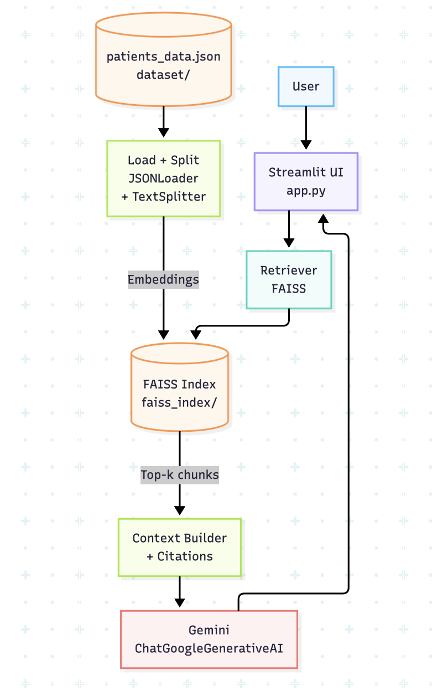

# AI Medical Assistant (RAG)

[](https://www.python.org/)
[](https://streamlit.io/)
[](https://python.langchain.com/)

A lightweight **Retrieval-Augmented Generation (RAG)** medical report search assistant built with **Streamlit + LangChain + FAISS**, using **Gemini** for answer generation and **HuggingFace embeddings** for retrieval.

> **Disclaimer:** This project is for educational/demo purposes. It is **not** a medical device and must **not** be used for diagnosis or treatment decisions.

---

## Demo

Add a demo GIF here (recommended path: `assets/demo.gif`):


If you don’t have a GIF yet, record a short run (10–20s) showing:
1) typing a patient query  
2) clicking **Start Search**  
3) viewing the answer + sources

---

## Architecture



---

## Data

This app searches a local JSON dataset (example: `dataset/patients_data.json`) containing patient-related fields such as medical history, chronic conditions, allergies, and clinical notes.

**Important notes:**
- Do **not** commit sensitive data (PHI/PII) to a public repository.
- Use synthetic/anonymized data for demos.
- The app does **not** download data automatically at runtime (recommended). You can either:
  - place the JSON file manually in `dataset/`, or
  - use an optional script to download it (see below).

---

## Project Structure

Recommended layout after refactor:

```text
.
├── app.py
├── src/
│   ├── config.py
│   └── rag/
│       ├── ingest.py
│       ├── index.py
│       ├── prompt.py
│       └── qa.py
├── scripts/
│   └── download_data.py
├── dataset/
│   └── patients_data.json
├── faiss_index/
└── .env.example
```

---

## Setup

### 1) Clone
```bash
git clone https://github.com/Nayan2701/AI-Medical-Assistant-RAG.git
cd AI-Medical-Assistant-RAG
```

### 2) Create venv + install dependencies
```bash
python -m venv .venv
source .venv/bin/activate  # Windows: .venv\Scripts\activate
pip install -U pip
pip install -r requirements.txt
```

### 3) Configure environment variables
Copy the example file and fill in values:

```bash
cp .env.example .env
```

Set your Google API key:

- macOS/Linux:
  ```bash
  export GOOGLE_API_KEY="..."
  ```
- Windows (PowerShell):
  ```powershell
  $env:GOOGLE_API_KEY="..."
  ```

> Tip: If you use `python-dotenv`, you can load `.env` automatically in your app. Otherwise, export env vars in your shell.

---

## Run the App

```bash
streamlit run app.py
```

Open the local URL Streamlit prints (usually `http://localhost:8501`).

---

## Building / Using the FAISS Index

On first run, the app will:
1) load JSON documents
2) split them into chunks
3) embed chunks with HuggingFace embeddings
4) build and persist a FAISS index into `faiss_index/`

On subsequent runs, it loads the saved index from disk.

---

## Optional: Download dataset via Google Drive (script)

If you want to download the dataset using a script (instead of manual placement), use `scripts/download_data.py`.

Example:

```bash
pip install gdown
export GDRIVE_FILE_ID="your_file_id_here"
python scripts/download_data.py
```

This will write to the path in `DATASET_PATH` (default: `dataset/patients_data.json`).

---

## Configuration

These environment variables are supported (see `.env.example`):

- `GOOGLE_API_KEY` – required (Gemini)
- `GEMINI_MODEL` – default: `gemini-1.5-flash`
- `DATASET_PATH` – default: `dataset/patients_data.json`
- `FAISS_DIR` – default: `faiss_index`
- `FAISS_INDEX_NAME` – default: `medical_index`
- `RETRIEVER_K` – default: `6`
- `HF_EMBEDDING_MODEL` – default: `all-MiniLM-L6-v2`

---

## Prompting & Citations

The assistant is instructed to:
- use **only** the retrieved context
- avoid hallucinations
- provide citations like `[S1]`, `[S2]`

The “Show retrieved sources” section lists which chunk came from which file/page metadata.

---

## Roadmap / Improvements

- Add evaluation (basic regression questions + expected citations)
- Add GitHub Actions CI (lint + formatting)
- Add better dataset schema validation
- Add Dockerfile for reproducible deployments
- Add a “rebuild index” command/script

---

## License

Add a license that matches your intended use (MIT/Apache-2.0/etc.). If you don’t have one yet, consider adding `LICENSE`.

---

## Acknowledgements

- Streamlit for the UI
- LangChain for RAG components
- FAISS for vector search
- Gemini for answer generation